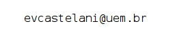

# Emerson Vitor Castelani

Seja bem vindo a minha página pessoal. Nesta página, você pode encontrar algumas
informações sobre as linhas de pesquisa que atuo e algumas informações sobre
meus interesses de pesquisa. Ainda, no link `Escritos` você pode encontrar alguns
escritos sobre temas relacionados a matemática e programação. Embora pareça um
pouco antiquado manter uma página pessoal, acredito muito no compartilhamento de
informação pela procura sem ficar limitado à uma rede social. Sabe quando nos
deparamos com algum problema para resolver e não sabemos como e saímos
procurando uma solução. Já reparou que, em boa parte dos casos, alguém que propõe uma 
solução ou que nos fornece uma dica de como resolver o problema, normalmente
disponibiliza a informação em um blog ou fórum. Pois bem, por acreditar que tais
soluções ainda são úteis, sempre que possível irei acrescenter algo a minha
documentação que talvez possa ajudar alguém. 

# Quem sou?

Atualmente sou professor na Universidade Estadual de Maringá, na área de
matemática atuando com temas ligados à matemática aplicada. Neste sentido,
normalmente ministro disciplinas com algum viés numérico e computacional. Ao
leitor deste espaço, certamente ficará claro isso ao analisar os escritos. 

# Contato

# Observações

Esta página está em etapa de construção e está indo ao ar pela primeira vez em
`23/05/2019`. Alguns erros de escrita e funcionamento podem acontecer devido à
falta de adequada revisão. 
